# Rust Learning Skills — Reference & Examples

17 interactive skills for understanding Rust concepts through visualization, mental models, and guided analysis.

**Invoke:**
- Direct: `/rust-learning:skill-name <args>`
- Browse: invoke `rust-learning` skill → pick from menu

---

## 1. error

**Context:** `rustc` just yelled at you. You want to know what it means in plain English and how to fix it.

**Call:**
```
/rust-learning:error
error[E0502]: cannot borrow `data` as mutable because it is also borrowed as immutable
 --> src/main.rs:4:5
  |
3 |     let r = &data[0];
  |              ---- immutable borrow occurs here
4 |     data.push(42);
  |     ^^^^^^^^^^^^^ mutable borrow occurs here
5 |     println!("{}", r);
  |                    - immutable borrow later used here
```

**Result (abbreviated):**

```
### PLAIN ENGLISH
You're trying to add to a vector while someone is still looking
at one of its elements. Rust prevents this because push() might
reallocate the vector, making the reference point to freed memory.

### WHAT HAPPENED
1. Line 3: You took a reference to the first element (&data[0])
2. Line 4: You tried to push (needs exclusive &mut access)
3. Line 5: The reference r is still needed here
Push could reallocate → r would dangle → undefined behavior.

### ANNOTATED CODE
let mut data = vec![1, 2, 3];
let r = &data[0];      // ← immutable borrow starts
data.push(42);          // ← CONFLICT: needs &mut, but r is active
println!("{}", r);      // ← r used here (borrow extends to here)

### TIMELINE
LINE 3: &data[0] borrowed ──────────────┐ immutable
LINE 4: data.push(42) CONFLICT ─────────┼── needs &mut
LINE 5: r used ─────────────────────────┘

### RULE VIOLATED
> One &mut OR any number of &, never both at the same time.

### FIX OPTIONS

1. **Read first, mutate after:**
   let r = &data[0];
   println!("{}", r);   // use r before push
   data.push(42);       // now safe — r is done

2. **Copy the value out:**
   let r = data[0];     // i32 is Copy — no borrow!
   data.push(42);       // fine
   println!("{}", r);   // r is an owned copy

3. **Index directly:**
   data.push(42);
   println!("{}", data[0]);  // borrow is temporary
```

**Thinking Flow:**

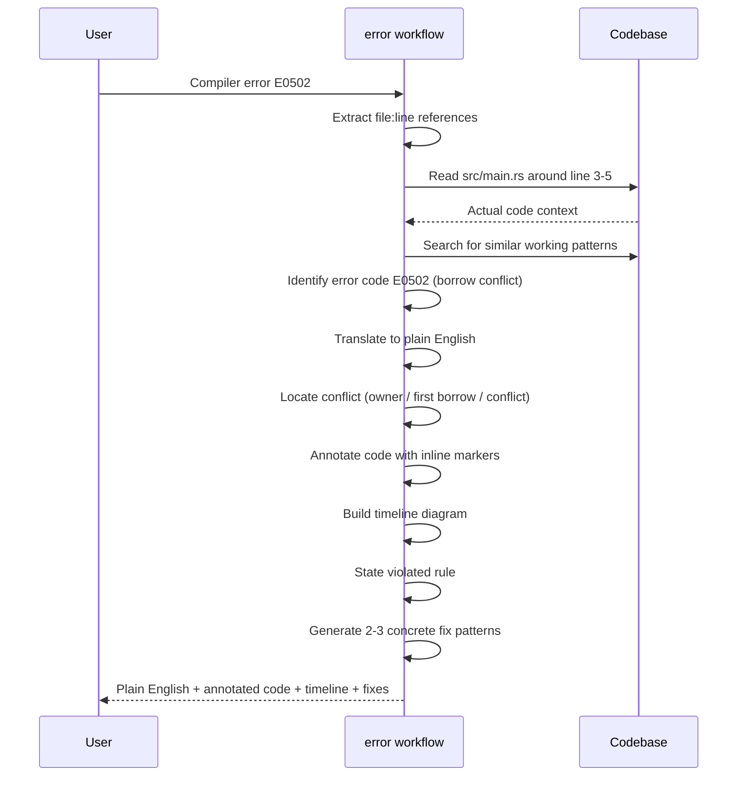
```mermaid
sequenceDiagram
    participant U as User
    participant W as error workflow
    participant Code as Codebase

    U->>W: Compiler error E0502
    W->>W: Extract file:line references
    W->>Code: Read src/main.rs around line 3-5
    Code-->>W: Actual code context
    W->>Code: Search for similar working patterns
    W->>W: Identify error code E0502 (borrow conflict)
    W->>W: Translate to plain English
    W->>W: Locate conflict (owner / first borrow / conflict)
    W->>W: Annotate code with inline markers
    W->>W: Build timeline diagram
    W->>W: State violated rule
    W->>W: Generate 2-3 concrete fix patterns
    W-->>U: Plain English + annotated code + timeline + fixes
```

---

## 2. trace-borrow

**Context:** The borrow checker says no. You can't tell where the conflict is or which borrow is still alive when it shouldn't be.

**Call:**
```
/rust-learning:trace-borrow
let mut data = vec![1, 2, 3];
let first = &data[0];
data.push(4);
println!("{}", first);
```

**Result (abbreviated):**

```
### BORROW TIMELINE
LINE │ CODE                      │ BORROWS ACTIVE
─────┼───────────────────────────┼────────────────
  1  │ let mut data = vec![..];  │ data: OWNER
  2  │ let first = &data[0];     │ data: OWNER, first: &data
  3  │ data.push(4);             │ ⚠ CONFLICT! first still active
  4  │ println!("{}", first);    │ data: OWNER, first: &data (last use)

### CONFLICT ANALYSIS
CONFLICT at LINE 3:
  - Active borrow: first (&data) created at LINE 2
  - Conflicting action: data.push(4) needs &mut data
  - Rule violated: One &mut OR many &, not both

### BORROW SPAN DIAGRAM
┌─── first: &data ──────────────────┐
│                                   │
──────────────────────────────────────
  2       3 (CONFLICT)       4
          │
          └── push() needs &mut

### RESTRUCTURING SUGGESTIONS
1. Reorder: push before borrowing
   data.push(4);
   let first = &data[0];
   println!("{}", first);

2. Clone: let first = data[0]; (Copy type, no borrow needed)
```

**Thinking Flow:**

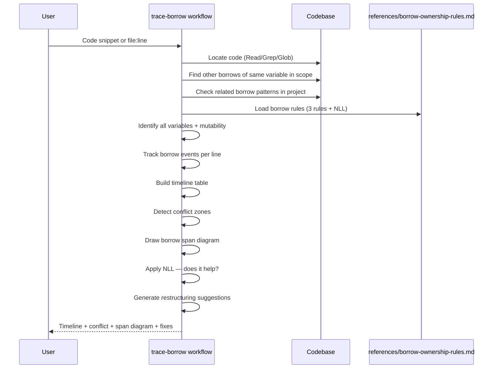
```mermaid
sequenceDiagram
    participant U as User
    participant W as trace-borrow workflow
    participant Code as Codebase
    participant Ref as references/borrow-ownership-rules.md

    U->>W: Code snippet or file:line
    W->>Code: Locate code (Read/Grep/Glob)
    W->>Code: Find other borrows of same variable in scope
    W->>Code: Check related borrow patterns in project
    W->>Ref: Load borrow rules (3 rules + NLL)
    W->>W: Identify all variables + mutability
    W->>W: Track borrow events per line
    W->>W: Build timeline table
    W->>W: Detect conflict zones
    W->>W: Draw borrow span diagram
    W->>W: Apply NLL — does it help?
    W->>W: Generate restructuring suggestions
    W-->>U: Timeline + conflict + span diagram + fixes
```

---

## 3. ownership-flow

**Context:** You passed a value to a function and now the compiler says it doesn't exist anymore. Where did it go?

**Call:**
```
/rust-learning:ownership-flow
let config = Config::load("app.toml");
let db = Database::connect(&config);
let server = Server::new(config);
println!("{}", config.port);
```

**Result (abbreviated):**

```
### OWNERSHIP SUMMARY
| Variable | Type     | Owns Heap? | Fate                    |
|----------|----------|------------|-------------------------|
| config   | Config   | Yes        | Moved to Server::new    |
| db       | Database | Yes        | Dropped at scope end    |
| server   | Server   | Yes        | Dropped at scope end    |

### FLOW DIAGRAM
LINE │ CODE                          │ OWNERSHIP STATE
─────┼───────────────────────────────┼─────────────────
  1  │ let config = Config::load()   │ config: OWNER ●
  2  │ let db = Database::connect()  │ config: OWNER ● ←─┐
     │                               │ db: OWNER ●    &config (borrow, temporary)
  3  │ let server = Server::new()    │ config: ✗ MOVED
     │                               │ server: OWNER ●
  4  │ println!("{}", config.port)   │ ✗ ERROR: config was moved

### VISUAL OWNERSHIP TRANSFER
      config              server
        │                   │
        ● Config::load()    │
        │                   │
   &config ──┤ borrow       │
        │    │(for db)      │
        │    ┘              │
        │                   │
        │───── MOVE ───────►●
        ×                   │
     (invalid)              │
                            ▼
                       DROP ○
```

**Thinking Flow:**

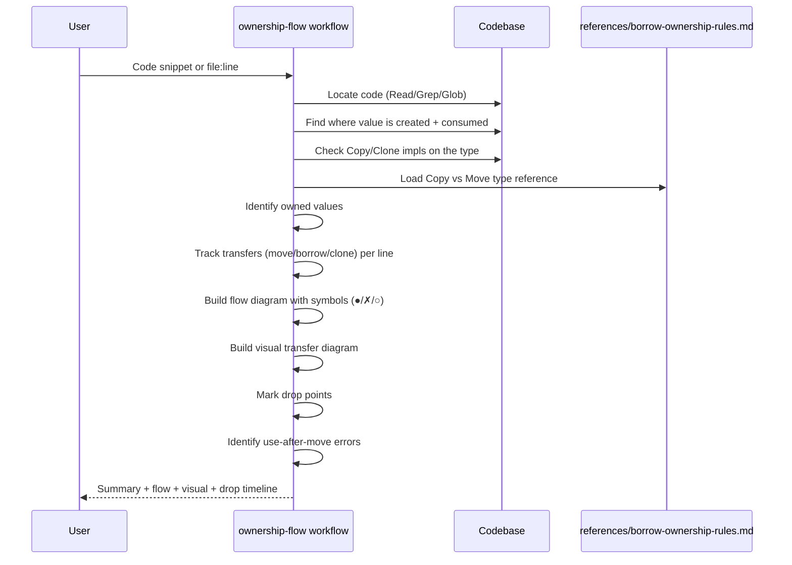
```mermaid
sequenceDiagram
    participant U as User
    participant W as ownership-flow workflow
    participant Code as Codebase
    participant Ref as references/borrow-ownership-rules.md

    U->>W: Code snippet or file:line
    W->>Code: Locate code (Read/Grep/Glob)
    W->>Code: Find where value is created + consumed
    W->>Code: Check Copy/Clone impls on the type
    W->>Ref: Load Copy vs Move type reference
    W->>W: Identify owned values
    W->>W: Track transfers (move/borrow/clone) per line
    W->>W: Build flow diagram with symbols (●/✗/○)
    W->>W: Build visual transfer diagram
    W->>W: Mark drop points
    W->>W: Identify use-after-move errors
    W-->>U: Summary + flow + visual + drop timeline
```

---

## 4. mental-model

**Context:** You hit a trait, macro, or type you haven't seen before. You want to actually understand it, not just memorize the syntax.

**Call:**
```
/rust-learning:mental-model impl Display for Email { fn fmt(&self, f: &mut fmt::Formatter) -> fmt::Result { write!(f, "{}", self.0) } }
```

**Result (abbreviated):**

```
### WHAT THIS IS
A trait implementation that teaches the compiler how to convert your Email
type into a human-readable string. Display is the "user-facing" formatting
trait — it powers `{}` in format strings.

### HOW IT WORKS
When you write `println!("{}", email)`, Rust calls `<Email as Display>::fmt()`.
The Formatter is a writer that buffers the output. `write!` is a macro that
calls fmt::Write::write_fmt on the formatter.

### MEMORY & LIFETIME
No allocations. fmt borrows &self (the Email) and &mut Formatter.
The Formatter is stack-allocated by the caller.

### USAGE PATTERNS
let email = Email::parse("test@example.com").unwrap();
println!("{}", email);           // calls Display
format!("User: {}", email);     // also Display
email.to_string();              // Display provides this for free

### GOTCHAS
- Display implies ToString — you get .to_string() automatically
- Debug ({:?}) is separate from Display ({})
- Display should be for end-users; Debug for developers
```

**Thinking Flow:**

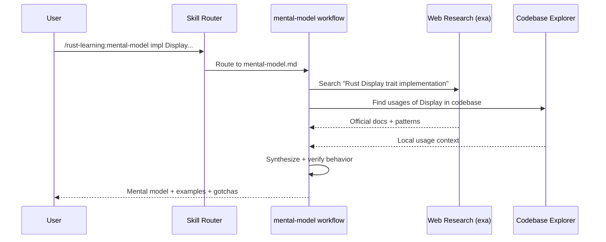
```mermaid
sequenceDiagram
    participant U as User
    participant S as Skill Router
    participant W as mental-model workflow
    participant Web as Web Research (exa)
    participant Code as Codebase Explorer

    U->>S: /rust-learning:mental-model impl Display...
    S->>W: Route to mental-model.md
    W->>Web: Search "Rust Display trait implementation"
    W->>Code: Find usages of Display in codebase
    Web-->>W: Official docs + patterns
    Code-->>W: Local usage context
    W->>W: Synthesize + verify behavior
    W-->>U: Mental model + examples + gotchas
```

---

## 5. variations

**Context:** You wrote working code but wonder — is there a more idiomatic way? What would an experienced Rustacean write instead? You want to see the same logic expressed in different styles to learn the language's texture.

**Call:**
```
/rust-learning:variations
fn get_username(user: &Option<User>) -> String {
    match user {
        Some(u) => {
            return u.name.clone();
        }
        None => {
            return String::from("anonymous");
        }
    }
}
```

**Result (abbreviated):**

```
## ORIGINAL
fn get_username(user: &Option<User>) -> String {
    match user {
        Some(u) => { return u.name.clone(); }
        None => { return String::from("anonymous"); }
    }
}
What it does: Returns user's name or "anonymous" if None.

---

## VARIATION 1: Tail expressions (remove explicit returns)
fn get_username(user: &Option<User>) -> String {
    match user {
        Some(u) => u.name.clone(),
        None => String::from("anonymous"),
    }
}

| Aspect | Detail |
|--------|--------|
| What changed | Removed `return` and braces — match arms are expressions |
| Why choose this | Idiomatic Rust: the last expression IS the return value |
| Tradeoff | Slightly less obvious to newcomers from C/Java |

---

## VARIATION 2: Using .map_or()
fn get_username(user: &Option<User>) -> String {
    user.as_ref()
        .map_or(String::from("anonymous"), |u| u.name.clone())
}

| Aspect | Detail |
|--------|--------|
| What changed | Replaced match with Option combinator |
| Why choose this | One-liner for simple Option→value transforms |
| Tradeoff | Less readable for complex logic; default eval'd eagerly |

---

## VARIATION 3: Using if let
fn get_username(user: &Option<User>) -> String {
    if let Some(u) = user {
        u.name.clone()
    } else {
        String::from("anonymous")
    }
}

| Aspect | Detail |
|--------|--------|
| What changed | if let instead of match — focuses on the Some case |
| Why choose this | When you only care about one variant |
| Tradeoff | Match is better when both arms have equal weight |

---

## VARIATION 4: Using .as_ref() + .map_or_else()
fn get_username(user: &Option<User>) -> String {
    user.as_ref()
        .map_or_else(|| "anonymous".into(), |u| u.name.clone())
}

| Aspect | Detail |
|--------|--------|
| What changed | Lazy default with map_or_else |
| Why choose this | Default is only computed when needed |
| Tradeoff | More complex API; overkill here since String::from is cheap |

---

## IDIOMATICITY RANKING
| Rank | Variation | Best When |
|------|-----------|-----------|
| 1 | Variation 1 (tail expressions) | Almost always — clean, clear |
| 2 | Variation 3 (if let) | When None case is trivial |
| 3 | Variation 2 (map_or) | Quick transforms in chains |
| 4 | Original | Never — explicit returns in match arms aren't idiomatic |
```

**Thinking Flow:**

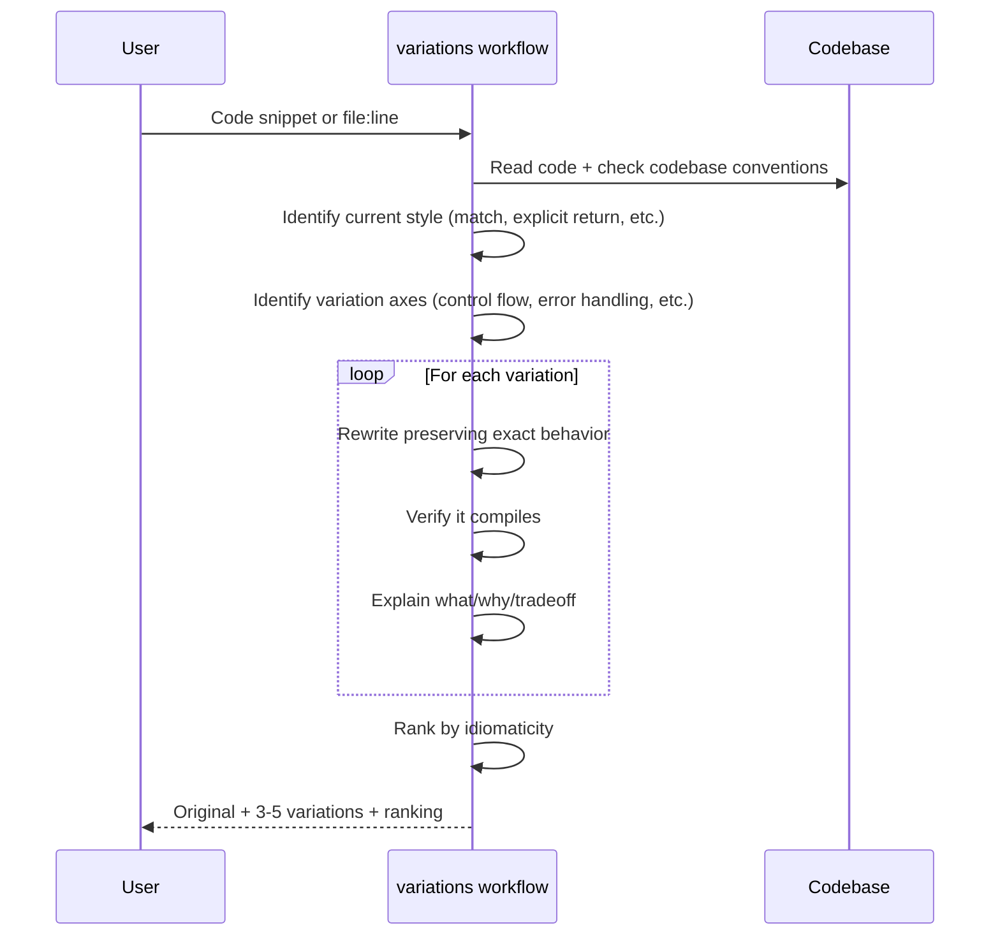
```mermaid
sequenceDiagram
    participant U as User
    participant W as variations workflow
    participant Code as Codebase

    U->>W: Code snippet or file:line
    W->>Code: Read code + check codebase conventions
    W->>W: Identify current style (match, explicit return, etc.)
    W->>W: Identify variation axes (control flow, error handling, etc.)
    loop For each variation
        W->>W: Rewrite preserving exact behavior
        W->>W: Verify it compiles
        W->>W: Explain what/why/tradeoff
    end
    W->>W: Rank by idiomaticity
    W-->>U: Original + 3-5 variations + ranking
```

---

## 6. why-clone

**Context:** There's `.clone()` all over the place. Some of them are probably just there to make the compiler stop complaining. Which ones can you kill?

**Call:**
```
/rust-learning:why-clone
fn process(data: &AppState) {
    let users = data.users.clone();
    let config = data.config.clone();
    let name = data.name.clone();
    send_report(users, config, &name);
}
```

**Result (abbreviated):**

```
### CLONE INVENTORY
| Line | Expression          | Type         | Classification |
|------|---------------------|--------------|----------------|
| 2    | data.users.clone()  | Vec<User>    | Avoidable      |
| 3    | data.config.clone() | Config       | Avoidable      |
| 4    | data.name.clone()   | String       | Avoidable      |

### CLONE ANALYSIS

**Clone at line 2: `data.users.clone()`**
- Why needed: Ownership transfer to send_report
- Cost: Expensive (clones entire Vec + each User)
- Alternative: Change send_report to accept &[User]

**Clone at line 4: `data.name.clone()`**
- Why needed: None — already passed as &name!
- Cost: Cheap (short string) but pointless
- Alternative: Remove clone, pass &data.name directly

### VERDICT
| Clone          | Keep? | Reason                        |
|----------------|-------|-------------------------------|
| users.clone()  | ✗ No  | Change send_report to &[User] |
| config.clone() | ✗ No  | Change to &Config             |
| name.clone()   | ✗ No  | Already borrowed on next line |

### REFACTORED
fn process(data: &AppState) {
    send_report(&data.users, &data.config, &data.name);
}
```

**Thinking Flow:**

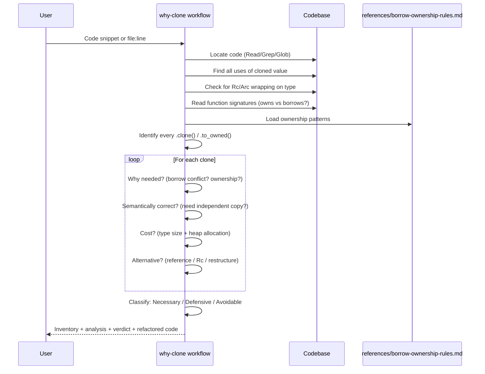
```mermaid
sequenceDiagram
    participant U as User
    participant W as why-clone workflow
    participant Code as Codebase
    participant Ref as references/borrow-ownership-rules.md

    U->>W: Code snippet or file:line
    W->>Code: Locate code (Read/Grep/Glob)
    W->>Code: Find all uses of cloned value
    W->>Code: Check for Rc/Arc wrapping on type
    W->>Code: Read function signatures (owns vs borrows?)
    W->>Ref: Load ownership patterns
    W->>W: Identify every .clone() / .to_owned()
    loop For each clone
        W->>W: Why needed? (borrow conflict? ownership?)
        W->>W: Semantically correct? (need independent copy?)
        W->>W: Cost? (type size + heap allocation)
        W->>W: Alternative? (reference / Rc / restructure)
    end
    W->>W: Classify: Necessary / Defensive / Avoidable
    W-->>U: Inventory + analysis + verdict + refactored code
```

---

## 7. trace-lifetimes

**Context:** There's a `'a` on a function signature and you're staring at it like hieroglyphics. Why is it there? What breaks without it?

**Call:**
```
/rust-learning:trace-lifetimes fn get_longest<'a>(x: &'a str, y: &'a str) -> &'a str
```

**Result (abbreviated):**

```
### WHAT THE LIFETIMES MEAN
fn get_longest<'a>(x: &'a str, y: &'a str) -> &'a str
               ^^     ^^          ^^           ^^
               │      │           │            └── Return valid for 'a
               │      │           └── y lives at least 'a
               │      └── x lives at least 'a
               └── Define lifetime parameter 'a

### THE CONTRACT
> "The returned reference is borrowed from one of the inputs,
> so it cannot outlive EITHER of them."

### SCOPE VISUALIZATION
fn main() {
    let string1 = String::from("long");  //─────┐ 's1
    let result;                          //     │
    {                                    //     │
        let string2 = String::from("x"); //──┐  │ 's2
        result = longest(&string1, &string2);│  │
    } // string2 dropped ────────────────────┘  │
    // result INVALID — tied to shorter lifetime │
    println!("{}", result); // ERROR!       │
} // string1 dropped ─────────────────────────┘

### ELISION RULES CHECK
- Could be elided: No
- Why explicit: Multiple input references — compiler can't infer
  which input the return borrows from
```

**Thinking Flow:**

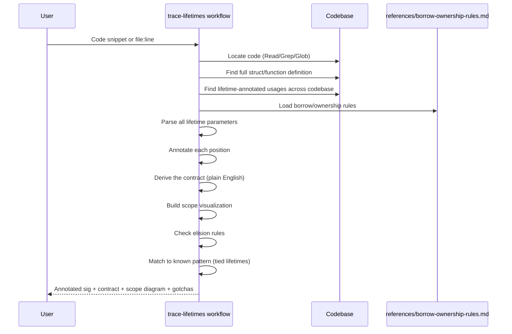
```mermaid
sequenceDiagram
    participant U as User
    participant W as trace-lifetimes workflow
    participant Code as Codebase
    participant Ref as references/borrow-ownership-rules.md

    U->>W: Code snippet or file:line
    W->>Code: Locate code (Read/Grep/Glob)
    W->>Code: Find full struct/function definition
    W->>Code: Find lifetime-annotated usages across codebase
    W->>Ref: Load borrow/ownership rules
    W->>W: Parse all lifetime parameters
    W->>W: Annotate each position
    W->>W: Derive the contract (plain English)
    W->>W: Build scope visualization
    W->>W: Check elision rules
    W->>W: Match to known pattern (tied lifetimes)
    W-->>U: Annotated sig + contract + scope diagram + gotchas
```

---

## 8. explain

**Context:** You're reading a function signature with generics, lifetimes, and trait bounds crammed together. You need it broken down piece by piece.

**Call:**
```
/rust-learning:explain auth-service/src/utils/auth.rs:generate_auth_cookie
```

**Result (abbreviated):**

```
### MODULE CONTEXT
File:   auth-service/src/utils/auth.rs
Module: crate::utils::auth

To use: use crate::utils::auth::generate_auth_cookie;

### FUNCTION SIGNATURE BREAKDOWN
pub fn generate_auth_cookie(email: &Email, token: &str) -> Cookie<'static>
//  ^^^                            ^^^^^^        ^^^^     ^^^^^^^^^^^^^^^
//  │                              │              │       │
//  │                              │              │       └── Returns owned Cookie
//  │                              │              │           with 'static lifetime
//  │                              │              └── borrowed string slice
//  │                              └── borrowed Email (parse-don't-validate type)
//  └── public visibility

### COMPONENT ANALYSIS

**`&Email`** — Borrows an Email
- Email is a validated newtype (parse-don't-validate)
- Only borrows — doesn't take ownership
- Caller keeps their Email after the call

**`-> Cookie<'static>`** — Returns owned cookie
- 'static means cookie owns all its data (no borrows)
- Caller receives full ownership
- Safe to store, send across threads, etc.

### USAGE EXAMPLES
use crate::utils::auth::generate_auth_cookie;

let email = Email::parse("user@example.com")?;
let token = generate_token(&email);
let cookie = generate_auth_cookie(&email, &token);
// cookie is owned, email and token still valid
```

**Thinking Flow:**

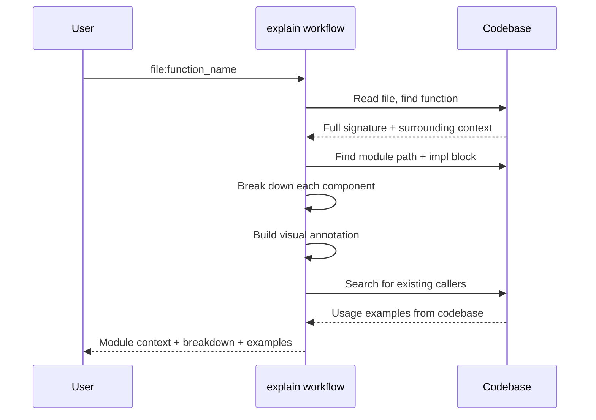
```mermaid
sequenceDiagram
    participant U as User
    participant W as explain workflow
    participant Code as Codebase

    U->>W: file:function_name
    W->>Code: Read file, find function
    Code-->>W: Full signature + surrounding context
    W->>Code: Find module path + impl block
    W->>W: Break down each component
    W->>W: Build visual annotation
    W->>Code: Search for existing callers
    Code-->>W: Usage examples from codebase
    W-->>U: Module context + breakdown + examples
```

---

## 9. trait-bounds

**Context:** There's a `where` clause with five trait bounds and you can't tell what any of them actually mean for your code.

**Call:**
```
/rust-learning:trait-bounds
fn spawn_task<F, T>(f: F) -> JoinHandle<T>
where
    F: FnOnce() -> T + Send + 'static,
    T: Send + 'static,
```

**Result (abbreviated):**

```
### BOUNDS BREAKDOWN
fn spawn_task<F, T>(f: F) -> JoinHandle<T>
where
    F: FnOnce() -> T + Send + 'static,
    // ────────┬─── ────┬─ ────┬────
    //         │        │      │
    //         │        │      └── F owns all data (no borrowed refs)
    //         │        └── F can be sent to another thread
    //         └── F is callable exactly once, returns T
    T: Send + 'static,
    // ────┬─ ────┬────
    //     │      └── T owns all data
    //     └── T can be sent back from the thread

### BOUND-BY-BOUND EXPLANATION
| Bound        | Meaning                          | Why Needed                    |
|--------------|----------------------------------|-------------------------------|
| FnOnce()->T  | Callable once, returns T         | Thread runs closure once      |
| F: Send      | Safe to transfer between threads | Closure crosses thread boundary|
| F: 'static   | No borrowed captures             | Thread may outlive caller     |
| T: Send      | Return value crossable           | Result sent back via JoinHandle|
| T: 'static   | Return owns its data             | Same — may outlive caller     |

### SIMPLIFICATION ANALYSIS
All bounds necessary for thread spawning. This is the canonical
spawn signature — can't remove any bound without breaking safety.
```

**Thinking Flow:**

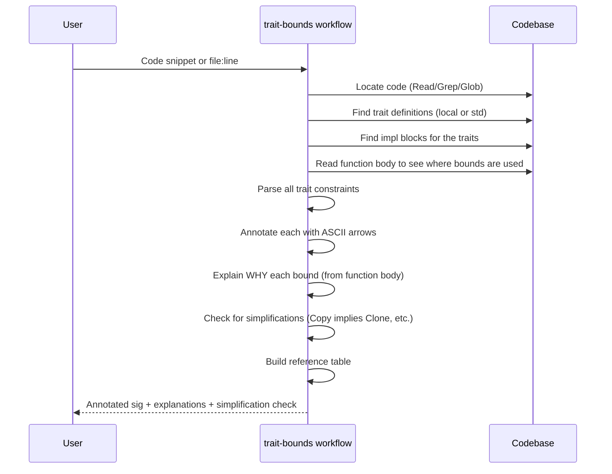
```mermaid
sequenceDiagram
    participant U as User
    participant W as trait-bounds workflow
    participant Code as Codebase

    U->>W: Code snippet or file:line
    W->>Code: Locate code (Read/Grep/Glob)
    W->>Code: Find trait definitions (local or std)
    W->>Code: Find impl blocks for the traits
    W->>Code: Read function body to see where bounds are used
    W->>W: Parse all trait constraints
    W->>W: Annotate each with ASCII arrows
    W->>W: Explain WHY each bound (from function body)
    W->>W: Check for simplifications (Copy implies Clone, etc.)
    W->>W: Build reference table
    W-->>U: Annotated sig + explanations + simplification check
```

---

## 10. trace-async

**Context:** Your async function does nothing when you call it. Or you can't figure out what `.await` actually does at each point.

**Call:**
```
/rust-learning:trace-async
async fn fetch_user(id: u32) -> Result<User, Error> {
    let response = client.get(url).send().await?;
    let body = response.text().await?;
    serde_json::from_str(&body).map_err(Error::Parse)
}
```

**Result (abbreviated):**

```
### ASYNC STRUCTURE
| Line | Type     | Description                    |
|------|----------|--------------------------------|
| 1    | async fn | Creates Future<Output=Result>  |
| 2    | .await   | Yield point — HTTP request     |
| 3    | .await   | Yield point — body read        |
| 4    | sync     | JSON parse (no yield)          |

### STATE MACHINE DIAGRAM
┌─────────────┐  poll()   ┌─────────────┐  poll()   ┌─────────────┐
│   State 0   │ ────────► │   State 1   │ ────────► │   State 2   │
│ build req   │  Pending  │ read body   │  Pending  │ parse JSON  │
└─────────────┘           └─────────────┘           └──────┬──────┘
                                                      Ready(Result)

### EXECUTION TRACE
TIME │ ACTION                        │ STATE
─────┼───────────────────────────────┼──────────
  1  │ fetch_user(42) called         │ Future created (NOT running!)
  2  │ .await or spawn()             │ Runtime takes over
  3  │ Runtime polls                 │ State 0 → builds request
  4  │ Hits send().await             │ Pending, yields to runtime
  5  │ HTTP response arrives         │ Re-polled → State 1
  6  │ Hits text().await             │ Pending, yields again
  7  │ Body ready                    │ Re-polled → State 2
  8  │ Parses JSON (sync, no yield) │ Ready(Ok(user))

### BLOCKING HAZARDS
| Line | Issue | Fix |
|------|-------|-----|
| 4    | serde_json::from_str is sync | OK for small payloads |
|      | (would be issue for large JSON) | Use spawn_blocking for >1MB |
```

**Thinking Flow:**

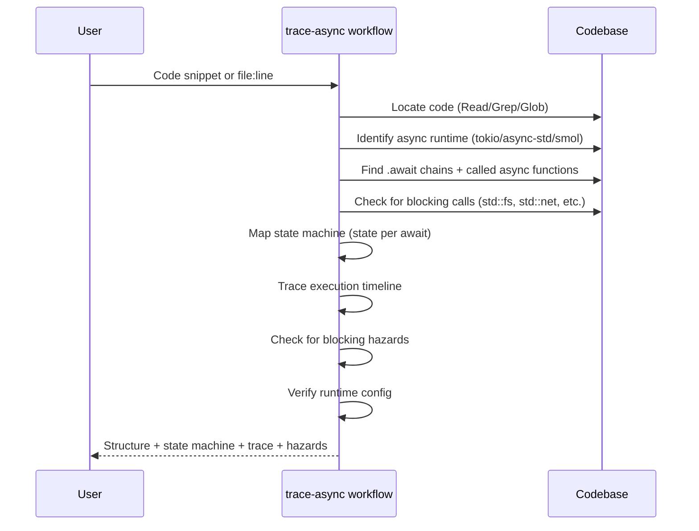
```mermaid
sequenceDiagram
    participant U as User
    participant W as trace-async workflow
    participant Code as Codebase

    U->>W: Code snippet or file:line
    W->>Code: Locate code (Read/Grep/Glob)
    W->>Code: Identify async runtime (tokio/async-std/smol)
    W->>Code: Find .await chains + called async functions
    W->>Code: Check for blocking calls (std::fs, std::net, etc.)
    W->>W: Map state machine (state per await)
    W->>W: Trace execution timeline
    W->>W: Check for blocking hazards
    W->>W: Verify runtime config
    W-->>U: Structure + state machine + trace + hazards
```

---

## 11. test-scaffold

**Context:** You finished writing a module and need tests. You want stubs for the happy path, error cases, and edge cases so you can fill them in.

**Call:**
```
/rust-learning:test-scaffold auth-service/src/domain/email.rs
```

**Result (abbreviated):**

```rust
#[cfg(test)]
mod tests {
    use super::*;

    // Email::parse
    #[test]
    fn should_parse_valid_email() {
        todo!()
    }

    #[test]
    fn should_reject_empty_string() {
        todo!()
    }

    #[test]
    fn should_reject_missing_at_symbol() {
        todo!()
    }

    #[test]
    fn should_reject_missing_domain() {
        todo!()
    }

    // Email::as_ref
    #[test]
    fn should_return_inner_string_ref() {
        todo!()
    }

    // Display impl
    #[test]
    fn should_display_as_email_string() {
        todo!()
    }
}
```

**Thinking Flow:**

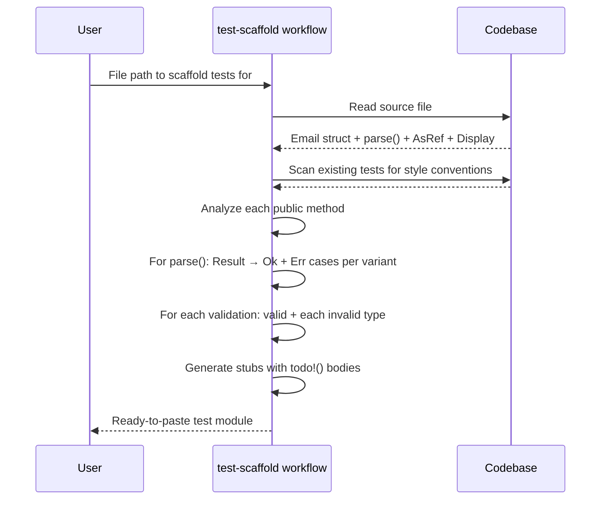
```mermaid
sequenceDiagram
    participant U as User
    participant W as test-scaffold workflow
    participant Code as Codebase

    U->>W: File path to scaffold tests for
    W->>Code: Read source file
    Code-->>W: Email struct + parse() + AsRef + Display
    W->>Code: Scan existing tests for style conventions
    Code-->>W: #[test], should_* naming
    W->>W: Analyze each public method
    W->>W: For parse(): Result → Ok + Err cases per variant
    W->>W: For each validation: valid + each invalid type
    W->>W: Generate stubs with todo!() bodies
    W-->>U: Ready-to-paste test module
```

---

## 12. assess-finding

**Context:** A reviewer or linter flagged something in your code. Is it legit? How bad is it? Should you actually fix it?

**Call:**
```
/rust-learning:assess-finding "The LoginError enum uses String for error messages instead of static &str, which allocates on every error"
```

**Result (abbreviated):**

```
### CURRENT FLOW
LoginError::InvalidCredentials(String::from("bad password"))
                               ^^^^^^^^^^^^^^^^^^^^^^^^^^^^
                               Heap allocation every time this error is created

### ASSESSMENT
| Aspect        | Assessment              |
|---------------|-------------------------|
| Issue valid?  | Yes                     |
| Severity      | Low (login is not hot path) |
| Fix complexity| ~10 lines               |
| Recommendation| Fix if refactoring, skip if just shipping |

### FIX
enum LoginError {
    InvalidCredentials,          // No payload needed
    InvalidEmail(&'static str),  // Static string, zero alloc
}
```

**Thinking Flow:**

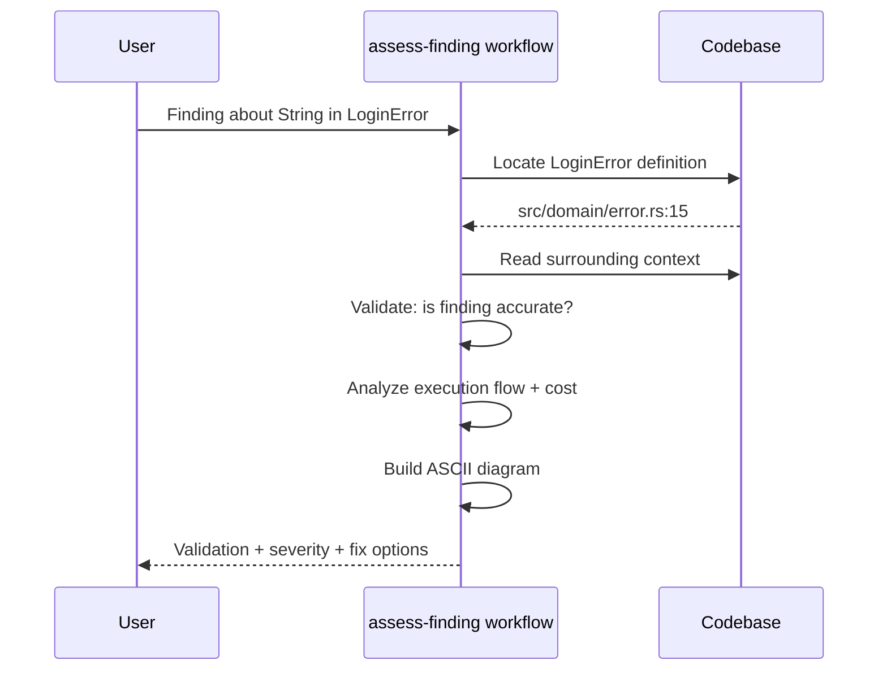
```mermaid
sequenceDiagram
    participant U as User
    participant W as assess-finding workflow
    participant Code as Codebase

    U->>W: Finding about String in LoginError
    W->>Code: Locate LoginError definition
    Code-->>W: src/domain/error.rs:15
    W->>Code: Read surrounding context
    W->>W: Validate: is finding accurate?
    W->>W: Analyze execution flow + cost
    W->>W: Build ASCII diagram
    W-->>U: Validation + severity + fix options
```

---

## 13. expand-macro

**Context:**  There's a `#[derive(...)]` on a struct. You want to see what code the compiler actually generates behind the scenes. This can also work on macros and derives.


**Call:**
```
/rust-learning:expand-macro
#[derive(Debug, Clone, PartialEq)]
pub struct Email(String);
```

**Result (abbreviated):**

```
### DERIVE EXPANSION

Original struct (unchanged):
pub struct Email(String);

Generated impl for Debug:
impl std::fmt::Debug for Email {
    fn fmt(&self, f: &mut std::fmt::Formatter<'_>) -> std::fmt::Result {
        f.debug_tuple("Email").field(&self.0).finish()
    }
}

Generated impl for Clone:
impl Clone for Email {
    fn clone(&self) -> Self {
        Email(self.0.clone())  // Clones inner String
    }
}

Generated impl for PartialEq:
impl PartialEq for Email {
    fn eq(&self, other: &Self) -> bool {
        self.0 == other.0  // Delegates to String's PartialEq
    }
}

### WHAT YOU CAN NOW DO
- email.clone()           → duplicate the Email
- println!("{:?}", email) → Email("test@example.com")
- email1 == email2        → compare by inner String

### DERIVE REQUIREMENTS
| Derive    | Requires  | Field Requirement      |
|-----------|-----------|------------------------|
| Debug     | —         | String: Debug ✓        |
| Clone     | —         | String: Clone ✓        |
| PartialEq | —         | String: PartialEq ✓    |

### HOW TO SEE ACTUAL EXPANSION
cargo install cargo-expand
cargo expand --lib
```

**Thinking Flow:**

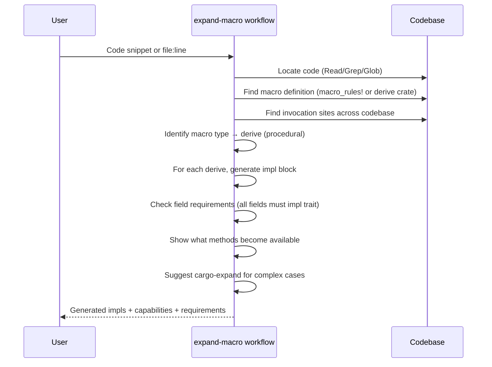
```mermaid
sequenceDiagram
    participant U as User
    participant W as expand-macro workflow
    participant Code as Codebase

    U->>W: Code snippet or file:line
    W->>Code: Locate code (Read/Grep/Glob)
    W->>Code: Find macro definition (macro_rules! or derive crate)
    W->>Code: Find invocation sites across codebase
    W->>W: Identify macro type → derive (procedural)
    W->>W: For each derive, generate impl block
    W->>W: Check field requirements (all fields must impl trait)
    W->>W: Show what methods become available
    W->>W: Suggest cargo-expand for complex cases
    W-->>U: Generated impls + capabilities + requirements
```

---

## 14. pattern-match

**Context:** You wrote a `match` with nested enums and guards. The compiler might be happy, but you're not sure you covered every case.

**Call:**
```
/rust-learning:pattern-match
match response {
    Ok(Response { status: 200, body }) => process(body),
    Ok(Response { status: 404, .. }) => not_found(),
    Ok(Response { status: n, .. }) if n >= 500 => server_error(n),
    Err(e) => handle_error(e),
}
```

**Result (abbreviated):**

```
### PATTERN ANALYSIS
Ok(Response { status: 200, body })
^^  ^^^^^^^^   ^^^^^^^^^^  ^^^^
│   │          │           └── binds body field to variable
│   │          └── matches literal 200
│   └── destructures Response struct
└── matches Ok variant

### EXHAUSTIVENESS CHECK
| Pattern                              | Covers              |
|--------------------------------------|----------------------|
| Ok(Response { status: 200, body })   | status == 200       |
| Ok(Response { status: 404, .. })     | status == 404       |
| Ok(Response { status: n, .. }) guard | status >= 500       |
| Err(e)                               | All Err variants    |

⚠ NOT EXHAUSTIVE: Missing Ok with status 1-199, 201-403, 405-499
Guards don't count for exhaustiveness!

### BINDING ANALYSIS
| Variable | What It Binds          | Mode |
|----------|------------------------|------|
| body     | Response.body field    | move |
| n        | Response.status value  | copy (u16 is Copy) |
| e        | Error value            | move |

### GUARD WARNING
> `if n >= 500` does NOT contribute to exhaustiveness checking.
> Add a catch-all: `Ok(_) => default_handler()`
```

**Thinking Flow:**

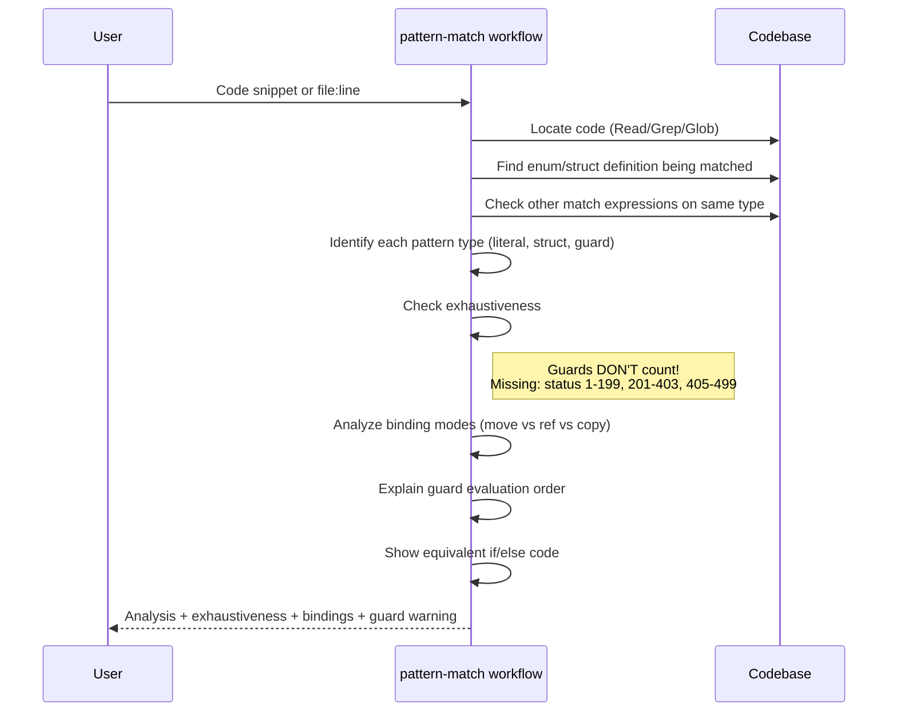
```mermaid
sequenceDiagram
    participant U as User
    participant W as pattern-match workflow
    participant Code as Codebase

    U->>W: Code snippet or file:line
    W->>Code: Locate code (Read/Grep/Glob)
    W->>Code: Find enum/struct definition being matched
    W->>Code: Check other match expressions on same type
    W->>W: Identify each pattern type (literal, struct, guard)
    W->>W: Check exhaustiveness
    Note right of W: Guards DON'T count!<br/>Missing: status 1-199, 201-403, 405-499
    W->>W: Analyze binding modes (move vs ref vs copy)
    W->>W: Explain guard evaluation order
    W->>W: Show equivalent if/else code
    W-->>U: Analysis + exhaustiveness + bindings + guard warning
```

---

## 15. smart-pointer

**Context:** Multiple parts of your code need access to the same data. Box? Rc? Arc? You're not sure which one fits.

**Call:**
```
/rust-learning:smart-pointer I have a config object that multiple HTTP handlers need to read, and occasionally one handler updates it. This is in an async Tokio server.
```

**Result (abbreviated):**

```
### YOUR SITUATION ANALYSIS
| Question          | Answer                      |
|-------------------|-----------------------------|
| Multiple owners?  | Yes — multiple handlers     |
| Multi-threaded?   | Yes — Tokio (multi-thread)  |
| Need mutation?    | Yes — occasional updates    |
| Recursive type?   | No                          |

### RECOMMENDATION
**Use: `Arc<RwLock<Config>>`**

Reason: Multiple threads need read access (most of the time) with
occasional writes. RwLock is better than Mutex here because reads
are far more frequent than writes.

### CODE EXAMPLE
use std::sync::Arc;
use tokio::sync::RwLock;  // Use Tokio's async RwLock!

let config = Arc::new(RwLock::new(Config::load()?));

// In each handler (clone Arc, cheap):
let config = config.clone();
async move {
    let cfg = config.read().await;  // Non-blocking read
    println!("{}", cfg.port);
}

// Update handler:
let mut cfg = config.write().await;  // Exclusive write
cfg.port = 9090;

### COMMON PITFALLS
- Use tokio::sync::RwLock (not std::sync) in async context
- Don't hold the lock across .await points — causes deadlocks
- Arc::clone() is cheap (atomic counter increment)

### ALTERNATIVES CONSIDERED
| Option           | Why Not                                   |
|------------------|-------------------------------------------|
| Arc<Mutex<T>>    | Works, but blocks ALL readers during write |
| Rc<RefCell<T>>   | Not thread-safe — panics in multi-thread   |
| Just Arc<T>      | No interior mutability for updates         |
```

**Thinking Flow:**

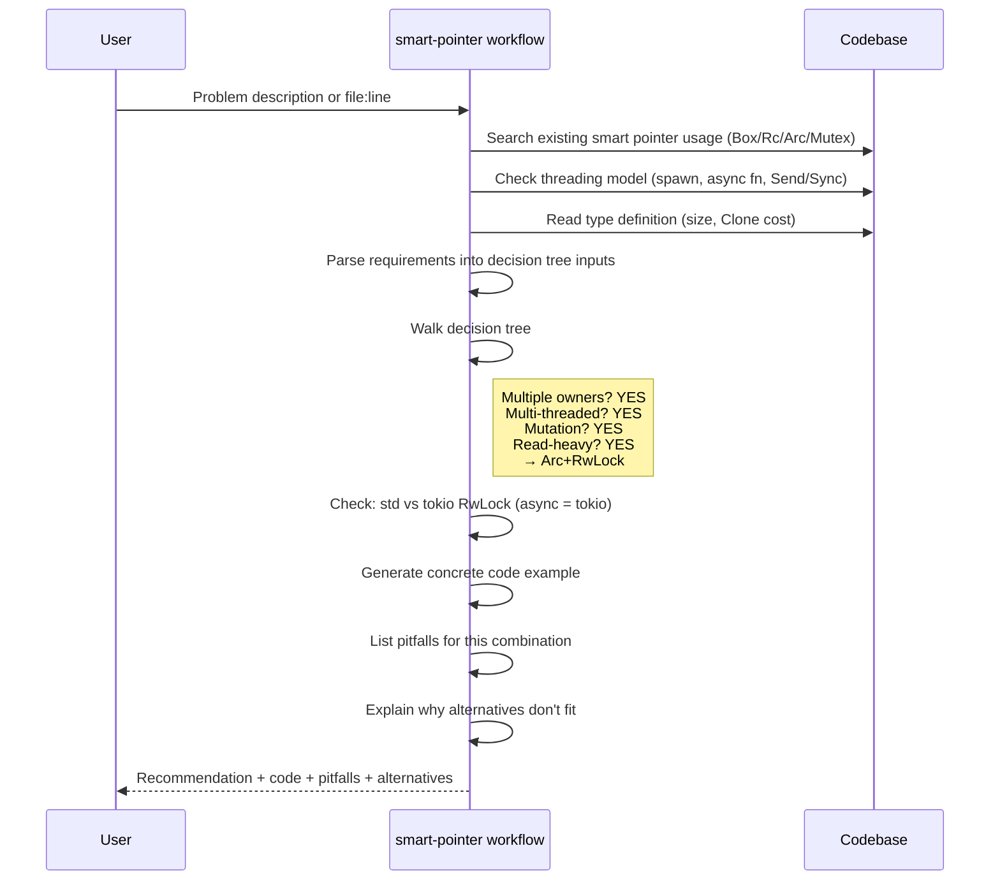
```mermaid
sequenceDiagram
    participant U as User
    participant W as smart-pointer workflow
    participant Code as Codebase

    U->>W: Problem description or file:line
    W->>Code: Search existing smart pointer usage (Box/Rc/Arc/Mutex)
    W->>Code: Check threading model (spawn, async fn, Send/Sync)
    W->>Code: Read type definition (size, Clone cost)
    W->>W: Parse requirements into decision tree inputs
    W->>W: Walk decision tree
    Note right of W: Multiple owners? YES<br/>Multi-threaded? YES<br/>Mutation? YES<br/>Read-heavy? YES<br/>→ Arc+RwLock
    W->>W: Check: std vs tokio RwLock (async = tokio)
    W->>W: Generate concrete code example
    W->>W: List pitfalls for this combination
    W->>W: Explain why alternatives don't fit
    W-->>U: Recommendation + code + pitfalls + alternatives
```

---

## 16. compare-dispatch

**Context:** Building a plugin system. Should you use generics (`impl Trait`) or trait objects (`dyn Trait`)?

**Call:**
```
/rust-learning:compare-dispatch I'm building a plugin system where users can register different handlers at runtime
```

**Result (abbreviated):**

```
### RECOMMENDATION FOR YOUR CASE
Use: `Box<dyn Handler>` (dynamic dispatch)

Reason: Plugin system requires registering different types at
runtime. You can't know all handler types at compile time.

### COMPARISON TABLE
| Aspect      | Static (impl Trait)    | Dynamic (dyn Trait)   |
|-------------|------------------------|-----------------------|
| Resolution  | Compile-time           | Runtime               |
| Flexibility | Same type only         | Mixed types OK ✓      |
| Performance | Faster (inlining)      | ~1-2ns overhead       |

### CODE EXAMPLE
trait Handler: Send + Sync {
    fn handle(&self, req: &Request) -> Response;
}

struct PluginRegistry {
    handlers: Vec<Box<dyn Handler>>,  // Mixed types OK
}

impl PluginRegistry {
    fn register(&mut self, h: impl Handler + 'static) {
        self.handlers.push(Box::new(h));
    }
}

### GOTCHAS
- Handler trait must be object-safe (no Self in return, no generics)
- Need Send + Sync if accessed from multiple threads
- Consider Arc<dyn Handler> if handlers are shared
```

**Thinking Flow:**

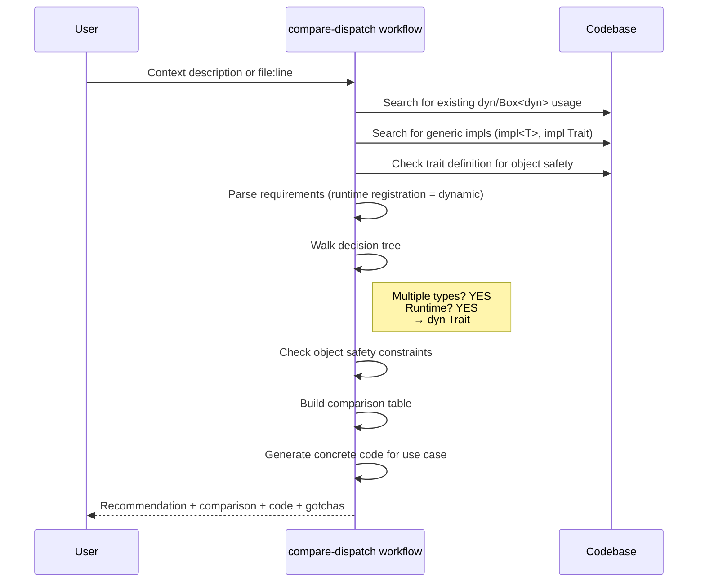
```mermaid
sequenceDiagram
    participant U as User
    participant W as compare-dispatch workflow
    participant Code as Codebase

    U->>W: Context description or file:line
    W->>Code: Search for existing dyn/Box<dyn> usage
    W->>Code: Search for generic impls (impl<T>, impl Trait)
    W->>Code: Check trait definition for object safety
    W->>W: Parse requirements (runtime registration = dynamic)
    W->>W: Walk decision tree
    Note right of W: Multiple types? YES<br/>Runtime? YES<br/>→ dyn Trait
    W->>W: Check object safety constraints
    W->>W: Build comparison table
    W->>W: Generate concrete code for use case
    W-->>U: Recommendation + comparison + code + gotchas
```

---

## 17. unsafe-audit

**Context:** Someone wrote `unsafe` and you need to know if it's actually sound or if it's a bug waiting to happen.

**Call:**
```
/rust-learning:unsafe-audit
fn get_unchecked(slice: &[u8], index: usize) -> u8 {
    unsafe { *slice.as_ptr().add(index) }
}
```

**Result (abbreviated):**

```
### UNSAFE OPERATIONS IDENTIFIED
| Line | Operation              | Used                    |
|------|------------------------|-------------------------|
| 2    | .add(index)            | Pointer arithmetic      |
| 2    | *ptr                   | Raw pointer dereference |

### INVARIANTS REQUIRED
| Invariant                    | Verified? | How to Ensure          |
|------------------------------|-----------|------------------------|
| index < slice.len()          | No ⚠      | No bounds check!       |
| Pointer is aligned           | Yes       | as_ptr() guarantees    |
| Pointer is non-null          | Yes       | Slice refs are non-null|
| No aliasing violations       | Yes       | Only reading           |

### UB RISK ANALYSIS
**Risk: Out-of-bounds access**
- What could happen: Reads arbitrary memory, possible segfault
- When: index >= slice.len()
- Severity: Exploitable (potential info leak)
- Mitigation: Add bounds check or make function unsafe

### SAFE ABSTRACTION ANALYSIS
**This can be wrapped in a safe abstraction:**
fn get_checked(slice: &[u8], index: usize) -> Option<u8> {
    slice.get(index).copied()  // Zero unsafe needed!
}

### VERDICT
| Aspect         | Assessment                              |
|----------------|-----------------------------------------|
| Correctness    | Has bugs (no bounds check)              |
| Documentation  | Missing — no SAFETY comment             |
| Can be safe?   | Yes — just use slice.get() or slice[i]  |
| Recommendation | Do not use — safe alternatives exist    |
```

**Thinking Flow:**

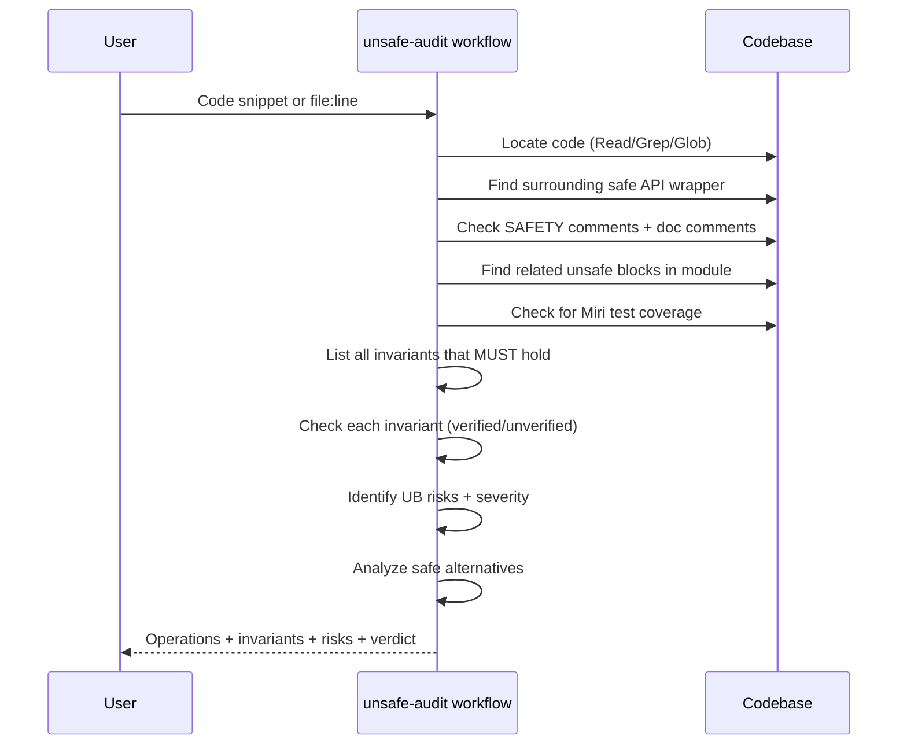
```mermaid
sequenceDiagram
    participant U as User
    participant W as unsafe-audit workflow
    participant Code as Codebase

    U->>W: Code snippet or file:line
    W->>Code: Locate code (Read/Grep/Glob)
    W->>Code: Find surrounding safe API wrapper
    W->>Code: Check SAFETY comments + doc comments
    W->>Code: Find related unsafe blocks in module
    W->>Code: Check for Miri test coverage
    W->>W: List all invariants that MUST hold
    W->>W: Check each invariant (verified/unverified)
    W->>W: Identify UB risks + severity
    W->>W: Analyze safe alternatives
    W-->>U: Operations + invariants + risks + verdict
```

---

## Quick Reference

| Skill | When to use | Key output |
|-------|-------------|------------|
| `error` | "What does this compiler error mean?" | Plain English + fixes |
| `trace-borrow` | "Why is the borrow checker angry?" | Timeline + conflict zones |
| `ownership-flow` | "Where did my value go?" | Move/borrow/drop diagram |
| `mental-model` | "What is this Rust thing?" | Mental model + examples |
| `variations` | "What are other ways to write this?" | 3-5 idiomatic alternatives + ranking |
| `why-clone` | "Do I really need all these clones?" | Clone audit + alternatives |
| `trace-lifetimes` | "What do these `'a` mean?" | Scope diagram + contract |
| `explain` | "Break down this function signature" | Component analysis |
| `trait-bounds` | "What does this `where` clause mean?" | Annotated bounds |
| `trace-async` | "What does this async code actually do?" | State machine + trace |
| `test-scaffold` | "Generate test stubs for this code" | todo!() test module |
| `assess-finding` | "Is this code finding valid?" | Validation + severity |
| `expand-macro` | "What does this macro generate?" | Expanded impl blocks |
| `pattern-match` | "Is this match exhaustive?" | Exhaustiveness + bindings |
| `smart-pointer` | "Box, Rc, or Arc?" | Decision tree + code |
| `compare-dispatch` | "Generics or trait objects?" | Decision tree + tradeoffs |
| `unsafe-audit` | "Is this unsafe code correct?" | Invariants + UB risks |
